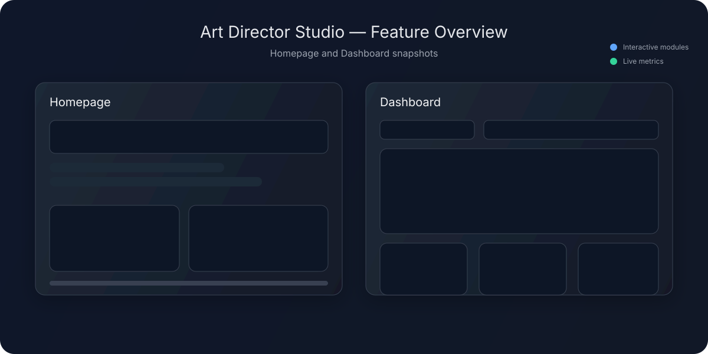

# Art Director Studio

Your AI-native creative agency workspace. From first idea to final delivery, Artie (your AI creative partner) helps you explore directions, generate visuals, collaborate with clients, and ship work faster.


## Overview

Art Director Studio unifies creative strategy, visual generation, project ops, and client collaboration in one place. Ideate campaigns, generate image directions, manage assets, and review deliverables — all with an AI copilot that remembers context and accelerates the path from brief to execution.




## Features

- AI Creative Copilot (Artie)
  - Structured chat for concepts, briefs, and iteration
  - Context-aware refinements and prompt suggestions
- Image Generation & Inspiration
  - Fast generations with size/aspect presets and guided tweaks
  - Reference-driven iterations and a browsable inspiration feed
- Project & Asset Workflow
  - Unified actions modal, versioning, and sharable links
  - Supabase Storage-backed asset pipeline
- Client Collaboration
  - Commenting, change history, and role-based access
  - Review flows built for creative feedback
- Insights & Analytics
  - Usage and performance dashboards for creative ops
- Billing & Access Controls
  - Stripe-powered checkout, subscriptions, and customer portal
  - Tiered feature access with guardrails
- Production-ready Frontend
  - Vite + React + TypeScript, shadcn/ui, Tailwind CSS
  - Optimized for speed, accessibility, and dark mode


## Tech Stack

- React + Vite + TypeScript (UI, routing, DX)
- Supabase (Auth, Postgres, Edge Functions, Storage)
- Stripe (payments, subscriptions, portal)
- Resend (transactional email)
- OpenDevin-style AI workflows (copilot, context, idempotent tasks)


## Getting Started

Prerequisites
- Node.js 18+ and npm 9+
- Supabase project (URL and public anon key)

1) Clone the repository
```
git clone https://github.com/justinlagos/artdirectorstudio.git
cd artdirectorstudio
```

2) Configure environment
Create a .env file in the project root and add your Supabase credentials:
```
VITE_SUPABASE_URL="https://YOUR-PROJECT.supabase.co"
VITE_SUPABASE_PROJECT_ID="YOUR_PROJECT_ID"
VITE_SUPABASE_PUBLISHABLE_KEY="YOUR_PUBLIC_ANON_KEY"
```

3) Install dependencies
```
npm install
```

4) Run the development server
```
npm run dev
```
The app will start on http://localhost:5173 by default.

5) Build for production (optional)
```
npm run build
npm run preview
```


## Contact

- Issues and feature requests: https://github.com/justinlagos/artdirectorstudio/issues
- General inquiries: please open an issue or contact the repository owner via GitHub profile
